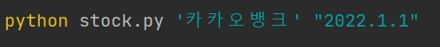

# NAVER株価日別データのクローリング及び視覚化
___
### 要求事項定義
>1.社名と取得開始日を入力してもらい、指定した日付から現時点まで日別株価情報をクローリングする。 
> 
>2.クロリングしたデータをcsvファイルとして保存し、出力する。 
&nbsp;&nbsp;&nbsp;-出力データ(日付、終値、ボリューム) 
&nbsp;&nbsp;&nbsp;-Plotを利用したグラフの出力
 

### 入力
>パラメータで入力される。- 例）ファイル名(stock.py), 種目名('카카오'), 取得開始日('yyyy.mm.dd')

 

### 出力
>csvファイルでデータを読み込んできて、日付、終値、ボリュームを出力し、plotライブラリーを使って株価をグラフで出力する。

 

### 実行方法(イメージ)
#### 種目名, 取得開始日時入力(日付指定)

 

### 出力例(イメージ)
#### 1. 出力データ

---

----
#### 2. Plotチャート   

---

---
