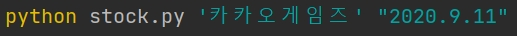
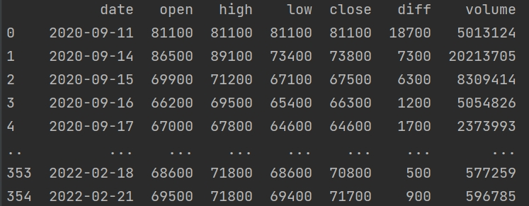
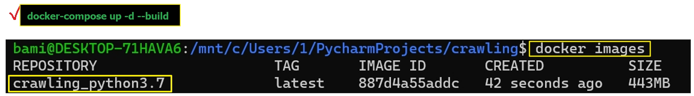
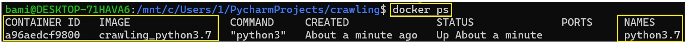

# NAVER株価日別データのクローリング及び視覚化
___
### ※要求事項定義
>1.社名と取得開始日を入力してもらい、指定した日付から現時点まで日別株価情報をクローリングする。 
> 
>2.クロリングしたデータをcsvファイルとして保存し、出力する。 
&nbsp;&nbsp;&nbsp;-出力データ(日付、終値、ボリューム) 
&nbsp;&nbsp;&nbsp;-Plotを利用したグラフの出力
>
> 3.ドッカーを利用して実装する。 
&nbsp;&nbsp;&nbsp;-Dockerfile, docker-compose.yml作成 
&nbsp;&nbsp;&nbsp;-ドッカーイメージを生成 
&nbsp;&nbsp;&nbsp;&nbsp;&nbsp;(ドッカーコンポーズプロンプトでビルドアップする) 
&nbsp;&nbsp;&nbsp;-コンテナ内で実装する
 

### ※入力
>パラメータで入力される。- 例）ファイル名(stock.py), 種目名('카카오게임즈'), 取得開始日('yyyy.mm.dd')

 

### ※出力
>csvファイルでデータを読み込んできて、日付別の株価を出力し、plotライブラリーを使って株価をグラフで表せる。

 

### ※実行方法(イメージ)
####  &nbsp;&nbsp;&nbsp;- 種目名, 取得開始日時入力(日付指定)

 

### ※出力例(イメージ)
#### 1. 出力データ

---

----
#### 2. Plotチャート   

---

---

### ※ドッカーを利用して実装してみる(イメージ)
#### 1. ドッカーイメージ生成

---

---

#### 2. コンテナの動作確認

___

___

#### 3. コンテナ内で実装する

---

---
